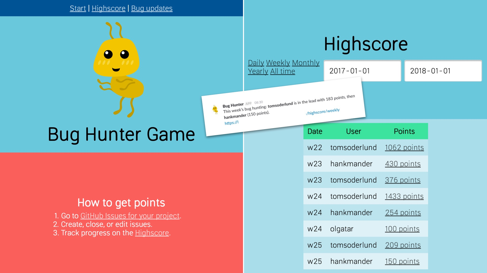

# Bug Hunter Game

Bug Hunter Game is an web service that turns GitHub Issues into a game.

Made by the team at **Weld** ([www.weld.io](https://www.weld.io?utm_source=github-bug-hunter-game)), the #codefree web and app creation tool:

## How to Run

Set environment variables:

	export SLACK_WEBHOOK_URL=https://hooks.slack.com/services/...
	export GITHUB_PROJECT_ID=username/projectname  // Note: Bug Hunter Game supports multiple projects for posting issues, but here you can only have one

Start with:

	npm run-script dev # development mode

or

	npm start # production mode

Server will default to **http://localhost:3033**

## How to Test

	npm test

## Entities

* Bug: similar to GitHub issue.
* Bug Update: a _change_ e.g. bug opened/closed.

## REST API

### Bugs

### Bug Updates

List bug updates

	curl http://localhost:3033/api/updates

Get a specific bug update

	curl http://localhost:3033/api/updates/[UPDATE_ID]

Create new bug update:

	curl -X POST -H "Content-Type: application/json" -d '{}' http://localhost:3033/api/updates

Update a bug update:

	curl -X PUT -H "Content-Type: application/json" -d '{}' http://localhost:3033/api/updates/[UPDATE_ID]

Recalculate a bug update:

	curl -X PUT -H "Content-Type: application/json" http://localhost:3033/api/updates/recalculate # Recalculate all
	curl -X PUT -H "Content-Type: application/json" -d '{ "ids": ["592ba447c8ab0281d22bfae3"] }' http://localhost:3033/api/updates/recalculate

Delete bug update:

	curl -X DELETE http://localhost:3033/api/updates/[UPDATE_ID]

Delete all bug updates:

	curl -X DELETE http://localhost:3033/api/updates/ALL

### GitHub webhook

Adapted from [GitHub’s example](https://developer.github.com/v3/activity/events/types/#issuesevent).

	curl -X POST http://localhost:3033/api/github-issues -H "Content-Type: application/json" -d \
	'{
		"action": "opened",
		"sender": {
			"login": "baxterthehacker",
			"id": 6752317
		},
		"issue": {
			"url": "https://api.github.com/repos/baxterthehacker/public-repo/issues/2",
			"id": 73464126,
			"number": 2,
			"title": "Spelling error in the README file",
			"body": "It looks like you accidently spelled commit with two ts.",
			"user": {
				"login": "baxterthehacker",
				"id": 6752317
			},
			"state": "open",
			"locked": false,
			"assignee": null,
			"milestone": null,
			"comments": 0,
			"created_at": "2015-05-05T23:40:28Z",
			"updated_at": "2015-05-05T23:40:28Z",
			"closed_at": null,
			"labels": [
				{
					"id": 208045946,
					"name": "bug",
					"color": "fc2929",
					"default": true
				}
			]
		},
		"repository": {
			"id": 35129377,
			"name": "public-repo"
		}
	}'

## GitHub integration

1. Go to the GitHub Webhooks page for your project, e.g. `https://github.com/USERNAME/REPONAME/settings/hooks`
2. Create a new webhook:
	* Payload URL: `https://YOUR-SERVER-NAME/api/github-issues`
	* Content type: `application/json`
	* Individual events: Issues + Issue comment

Note: Bug Hunter Game supports multiple projects for posting issues.

## Slack integration

1. Create a new Slack app: [https://api.slack.com/apps](https://api.slack.com/apps)
2. Set the environment variable `SLACK_WEBHOOK_URL` to the URL that Slack generated for you.
3. Set up a scheduled task (e.g. using Heroku Scheduler) that runs `node app/scheduler/postToSlack.js` for instance once a day.

## Deploying on Heroku

	# Set up and configure app
	heroku create MYAPPNAME
	heroku config:set NODE_ENV=production
	heroku config:set HOSTNAME=https://MYAPPNAME.herokuapp.com
	heroku config:set SLACK_WEBHOOK_URL=https://hooks.slack.com/services/...
	heroku config:set GITHUB_PROJECT_ID=username/projectname
	heroku addons:create mongolab
	git push heroku master
